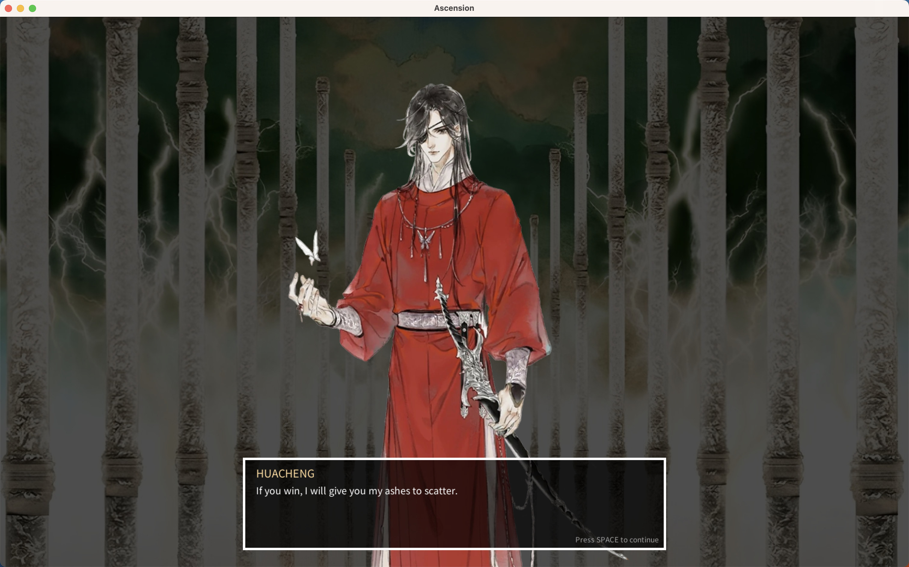

# Ascension

A 2d narrative driven roguelike game based off of the novel Tian Guan Ci Fu.
Made with Lua's Love2D framework.

## Gameplay sections currently playable (2): 

- Huacheng entering Heaven and challenging 35 Heavenly Officials
- Huacheng fights Martial Gods

## Gameplay sections in progress:
- Huacheng debates Literature Gods (WIP - unfinished)
- Huacheng burns down the temples of the Gods (WIP - unfinished)

- Huacheng's birth as Ghost King in Mt. Tonglu

## Player abilities
### Melee Attack (E-ming Slash)
- Cooldown: 1 second

### Ranged Attack (Silver Butterflies)
- Cooldown: 3 seconds

### Teleport Ability (Dice Teleport)
- Cooldown: 5 seconds

## Enemy behaviour

- Will chase player if out of range

