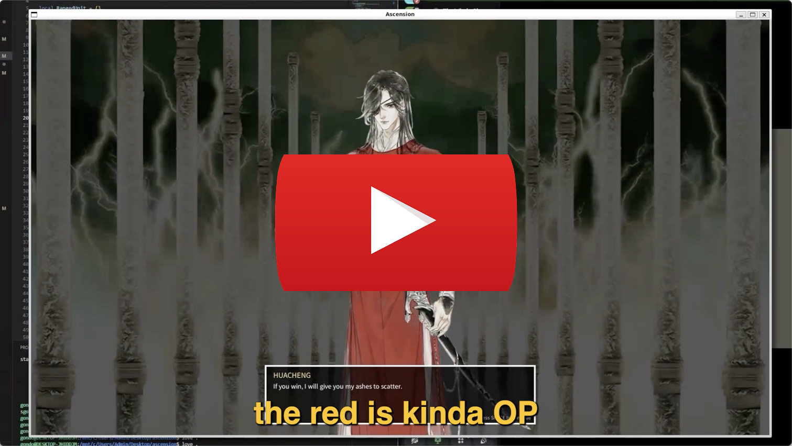
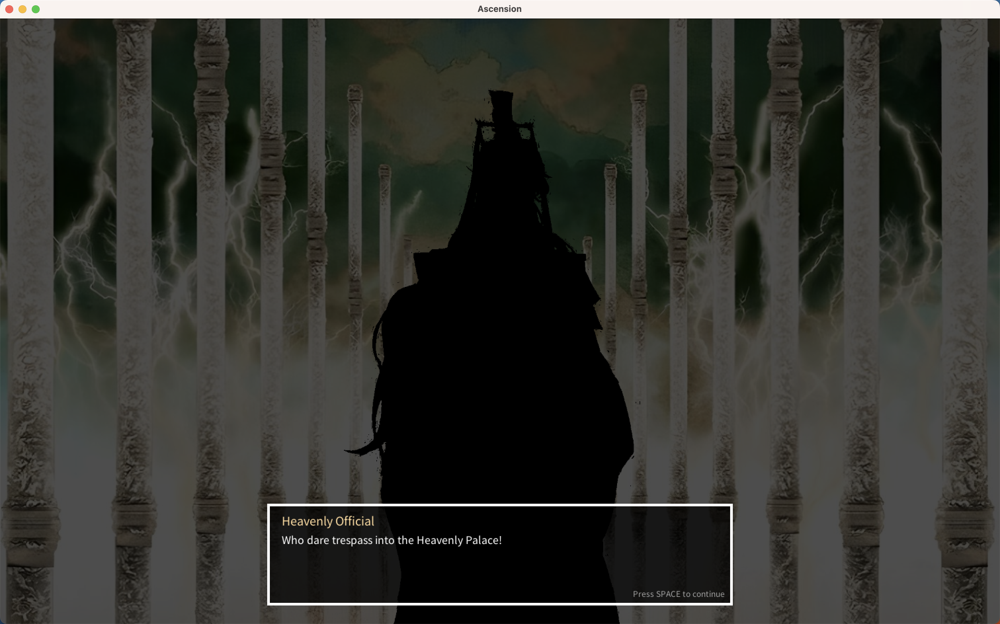
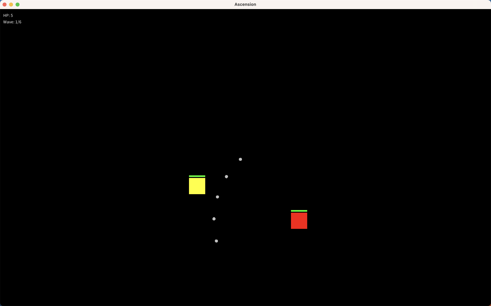

# Ascension

*A 2D narrative-driven roguelike based on the novel Tian Guan Ci Fu.*  
Built with [Love2D](https://love2d.org/) (Lua).

[](https://youtu.be/1ZFHpS1bF18)





---

## Gameplay Overview

**Ascension** follows Huacheng as he storms the Heavenly Court, facing Martial and Literature Gods in a sequence of battles and debate-driven interludes. The game alternates between **real-time action combat** and **dialogue sequences** that advance the story.

### Current Playable Sections

- Huacheng’s arrival in Heaven and challenge to the Martial Gods  
- Combat against successive waves of Heavenly Officials

### In-Progress Sections

- Debates with the Literature Gods  
- Temple-burning sequences  
- Flashbacks to Huacheng’s origin on Mt. Tonglu  

---

## Controls

| Action               | Key / Mouse   |
|----------------------|---------------|
| Move                 | W A S D       |
| Melee attack (slash) | Left Mouse    |
| Ranged attack        | Right Mouse   |
| Teleport (blink)     | Spacebar      |
| Dodge / Roll         | Left Shift    |
| Advance dialogue     | Spacebar      |
| Open settings        | Escape        |

---

## Player Stats

| Attribute            | Value              |
|----------------------|--------------------|
| Health               | 100                |
| Move Speed           | 200 px/s           |
| Melee Damage         | 5                  |
| Melee Range          | 120 px             |
| Melee Cooldown       | 1 s                |
| Ranged Damage        | 2 (per projectile) |
| Ranged Projectiles   | 5 (in a spread)    |
| Ranged Cooldown      | 2 s                |
| Teleport Radius      | 370 px             |
| Teleport Cooldown    | 12 s               |
| Dodge Duration       | 0.4 s              |
| Dodge Cooldown       | 4 s                |

---

## Player Abilities

### E-ming Slash (Melee)  
- A wide-area slash aimed at your cursor.  
- **Cooldown:** 1 s  

### Silver Butterflies (Ranged)  
- Fires 5 projectiles in a spread pattern.  
- **Cooldown:** 2 s  

### Teleport (Blink)  
- Instant blink to your mouse position, up to **370 px** away.  
- **Cooldown:** 12 s  
- Great for quick repositioning or dodging enemy attacks.  

### Dodge
- A short, directional roll that briefly boosts your speed.  
- Over the **0.4 s** roll, your speed follows a **4 → 3 → 2 → 1** multiplier curve.  
- **Cooldown:** 4 s  
- Use to slip through enemy attacks or close gaps.

---

## Enemy Types

### 🟡 Base Melee Unit  
- Standard slashing enemy.  
- Balanced health & speed.  
- **Color:** Yellow  

### 🔴 Charge Unit  
- Leaps in with a high-damage charge dash.  
- Faster than base units but lower health.  
- Starts each wave on its charge cooldown to avoid early burst.  
- **Color:** Red  

### 🔵 Ranged Unit  
- Channels a beam attack that damages anything in its line of fire.  
- Has a visible casting phase before firing.  
- Fragile but punishing if you’re caught in the beam.  
- **Color:** Blue  

---

## Enemy Stats Scaling

Each enemy’s stats scale per wave:

| Base Stat             | Increment per Wave |
|-----------------------|--------------------|
| Health                | +4                 |
| Move Speed            | +15 px/s           |
| Max Speed             | +15 px/s           |
| Base Attack Damage    | 1                  |
| Base Attack Cooldown  | 1.5 s              |

Type-specific multipliers:

- **Charge units:** 0.6× health, 1.25× speed, 1.2× charge damage  
- **Ranged units:** 0.4× health, 1.2× attack range, beam attacks  

---

## Wave System

Enemies spawn in fixed waves:

```lua
Enemy.spawnRates.waves = { 2, 4, 6, 8, 10, 11 }